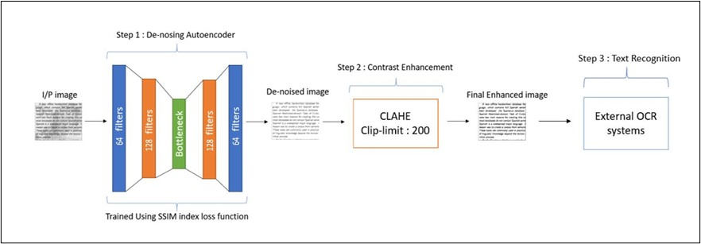

# Enhacement-Prior-for-OCR-systems
## - In this repository we will perform Textual image enhancement using Denoising Autoencoders and Adaptive Histogram Equalization
### - The following steps will be performed to obtain the final result :-

